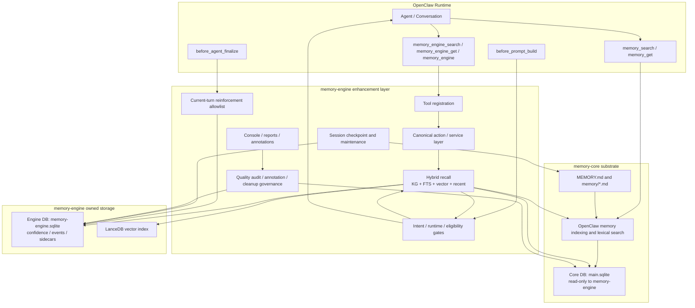

# Memory Engine for OpenClaw

> **Status: Current project overview**
>
> 本 README 只保留稳定的项目定位、系统边界和操作入口。发布版本以 Git tag 与 commit 为准；可调参数、阈值和实现细节以代码、测试及 [`docs/README.md`](docs/README.md) 中列出的现行契约为准。

[](http://localhost:8787/)
[](openclaw.plugin.json)
[](package.json)
[](https://www.sqlite.org/)

> 📚 **文档入口**：先阅读 [`docs/README.md`](docs/README.md)，了解当前架构边界、治理规则、文档权威层级和按任务阅读路径。

## 项目定位

Memory Engine 是 OpenClaw `memory-core` 之上的**增强与治理层**，不是 memory slot 的替代实现。

- `memory-core` 继续拥有标准 `memory_search` / `memory_get` 工具以及 `MEMORY.md`、`memory/*.md` 的基础索引。
- `memory-engine` 提供混合检索重排、置信度生命周期、AutoRecall、安全强化、checkpoint、质量审计、人工标注和 Console 能力。
- 面向 Agent 的增强工具是 `memory_engine_search` 与 `memory_engine_get`；`memory_engine` 保留为兼容和管理 action router。
- `memory-engine` 不注册或覆盖标准 `memory_search` / `memory_get`，也不占用 `plugins.slots.memory`。
- `active-memory` 与 memory-engine AutoRecall 默认都不应同时启用；没有显式去重时，同时启用会造成重复召回和重复注入。

当前工具与插件契约见：

- [`docs/agent-memory-tool-strategy.md`](docs/agent-memory-tool-strategy.md)
- [`docs/openclaw-memory-contract-compat.md`](docs/openclaw-memory-contract-compat.md)

## 当前总体架构



这张图只描述稳定边界，不承诺固定通道数量、固定权重或固定阈值。更细的入口、数据流和治理关系见 [`docs/README.md`](docs/README.md)。

## 不可破坏的系统不变量

| 不变量 | 当前约束 |
| --- | --- |
| **memory-core 所有权** | 标准 memory slot、`memory_search`、`memory_get` 和基础文件索引仍归 memory-core 所有 |
| **Core DB 写保护** | memory-engine 可以有意读取已 attach 的 `core.*`，但不得写入；Engine DB 写入必须继续可用 |
| **Canonical action 边界** | tool、CLI、hook 和维护入口不得复制或绕过 canonical action/service 业务逻辑 |
| **检索不等于强化** | 只有当轮 AutoRecall 实际注入或当轮 `memory_engine_get` 成功读取的 ID，才允许进入引用强化候选集合 |
| **AutoRecall 默认关闭** | AutoRecall 是显式 opt-in；长输入、低相关候选和受污染候选还要经过运行时与 eligibility 安全门 |
| **事件时间不可伪造** | 不得用 `updated_at`、文件 mtime、批量写入时间、导入时间或路径日期冒充精确事件时间 |
| **源码不等于运行时** | 修改仓库源码后，必须重新安装或 reload 插件，才能声明 OpenClaw 运行时行为已变化 |

数据库安全、运行时同步和开发纪律见 [`AGENTS.md`](AGENTS.md)。事件时间决策见 [`docs/adr/event-time-ownership.md`](docs/adr/event-time-ownership.md)。

## 当前检索与召回管线

`hybridSearch` 当前是多阶段、可配置的检索管线，而不是 README 中固定的一条数学公式：

1. **查询归一化**：剥离 prompt metadata，生成 FTS 查询、fallback 查询、token 和精确片段信号。
2. **词法优先召回**：先收集 KG 与 FTS 候选并计算 lexical confidence。
3. **向量惰性启用**：词法证据足够强时可以跳过向量通道；否则使用 LanceDB 向量召回。
4. **近期记忆补充**：根据 FTS 结果和隔离能力选择 recent 候选或 fallback 路径。
5. **RRF 融合**：对实际返回结果的通道做 Reciprocal Rank Fusion，不假设固定通道数量。
6. **可解释重排**：在语义信号和 RRF 分数之外，叠加可配置的类别、新近度、置信度和外部来源 boost。
7. **候选治理**：执行最低置信度、类别门、AutoRecall eligibility、污染风险和 disclosure 策略。
8. **输出或注入**：显式搜索返回结果；AutoRecall 只有通过 intent、runtime 和 eligibility gate 后才生成 prompt supplement。

当前实现和参数权威来源：

- 检索编排：[`lib/recall/hybrid-search.js`](lib/recall/hybrid-search.js)
- 通道融合与重排：[`lib/recall/hybrid/fusion.js`](lib/recall/hybrid/fusion.js)
- 默认参数：[`lib/config/defaults.js`](lib/config/defaults.js)
- AutoRecall eligibility：[`lib/recall/auto-recall-eligibility.js`](lib/recall/auto-recall-eligibility.js)
- AutoRecall runtime gate：[`lib/recall/auto-recall-runtime-gate.js`](lib/recall/auto-recall-runtime-gate.js)

README 故意不复制 `rrfK`、topK、阈值、boost 权重等具体数值，避免文档参数与运行时代码再次漂移。调参必须同时检查配置默认值、覆盖配置、debug metadata 和测试。

Legacy fallback code inventory 的顶层计数表示**已分类 finding 数量**，不是唯一文件数、测试文件数或测试用例数。同一文件中的不同符号、不同代码行或不同引用类别会分别计数；解读 inventory 时应结合 `categories` 中的明细，而不是把顶层数字直接当作文件或测试数量。

## 置信度生命周期

memory-engine 对受管理记忆维护 category、confidence、base tau、hit count、保护状态、冲突状态和归档状态。

- 写入或同步时为受管理记忆建立置信度侧车记录。
- 检索时惰性计算实时置信度，不用周期性全表写回来模拟时间流逝。
- 冲突记忆在实时置信度计算时受到惩罚。
- 受保护记忆不执行普通衰减路径。
- 引用强化只允许作用于当前 turn allowlist 中的记忆，并执行有上限的置信度提升。
- 外部或未受 engine 管理的候选使用独立的 `confidence_mode`，不能伪装成拥有 engine confidence 记录。

当前公式、类别默认值和强化实现见 [`lib/memory-confidence.js`](lib/memory-confidence.js)。这些数值属于实现配置，不再复制到 README。

## 写入、Checkpoint 与生命周期

- Tool 行为通过 [`lib/tools/register-memory-engine-tools.js`](lib/tools/register-memory-engine-tools.js) 注册，并路由到 [`lib/tools/memory-engine-actions.js`](lib/tools/memory-engine-actions.js)。
- 唯一 canonical checkpoint implementation 是 `bin/session-checkpoint.js` 与 `lib/checkpoint/*`。
- `workspace/scripts/session-checkpoint.js` 仅允许作为 thin shim CLI 入口，负责透传 `argv`、`env` 和 `stdio`。
- 不要在 legacy workspace script、cron wrapper 或 fallback shell 中复制 raw evidence collection、reset 扫描、LLM prompt assembly 或 smart-add 写入策略。
- `memory/episodes/YYYY-MM-DD.md` 是生成型 episode 的 canonical 文件路径；legacy mirror 只能作为审计或迁移对象。
- 数据清理默认遵循 audit / preview / human confirmation / guarded apply / rollback 的顺序，不允许从诊断直接跳到不可逆写入。

入口治理基线见 [`docs/memory-entry-boundary-audit.md`](docs/memory-entry-boundary-audit.md)。

## Agent 工具

| 工具 | 所有者 | 用途 |
| --- | --- | --- |
| `memory_search` | memory-core | 标准 OpenClaw memory 文件检索 |
| `memory_get` | memory-core | 读取标准 memory 文件内容 |
| `memory_engine_search` | memory-engine | 使用 engine 混合检索与治理元数据搜索 |
| `memory_engine_get` | memory-engine | 显式读取搜索结果的完整记忆，并建立当轮强化证据 |
| `memory_engine` | memory-engine | 兼容和管理 action router；不替代窄搜索/读取工具 |

Agent 的默认选择规则见 [`docs/agent-memory-tool-strategy.md`](docs/agent-memory-tool-strategy.md)。

## Console Annotation Workflow

- 人工标注主流程见 `docs/human-annotation-gold-set.md`。
- `/reports` ↔ `/annotations` GUI handoff smoke runbook 见 `docs/smoke-tests/console-annotation-report-handoff.md`。
- 回归验证命令：`npm run smoke:console-annotation-handoff`。
- 该 GUI 路径只读取 whitelisted reports，不上传 labels，不写 DB，不执行 apply / unarchive / category update / delete / quarantine / reinforce。

Console 和质量工具属于治理界面，不是绕过 action/service、DB guard 或人工确认的管理后门。

## 本地开发与运行时同步

安装依赖并执行静态检查与测试：

```bash
npm install
npm run check
npm test
```

启动 Console：

```bash
npm run console
```

查看 CLI：

```bash
node bin/memory-engine-cli.js --help
```

将当前源码重新安装到 OpenClaw 运行时：

```bash
openclaw plugins install . --force
```

安装后应按改动范围执行 targeted tests、runtime smoke 和 debug metadata 检查。完整步骤见 [`docs/runtime-sync.md`](docs/runtime-sync.md) 与 [`docs/smoke-tests/README.md`](docs/smoke-tests/README.md)。

## 常用治理命令

```bash
npm run memory:quality
npm run smoke:quality-baseline
npm run smoke:smart-add-duplicates
npm run preview:smart-add-duplicate-cleanup
npm run memory:cleanup-orphan-confidence
npm run smoke:console-annotation-handoff
```

所有 cleanup/apply 类命令都必须先阅读对应设计或操作协议，不能仅凭命令名称推断其是否会写库。

## 仓库导航

| 路径 | 职责 |
| --- | --- |
| `index.js` | 插件 bootstrap、依赖注入和 OpenClaw hook 编排 |
| `lib/tools/` | 工具声明与 canonical runtime action layer |
| `lib/recall/` | Hybrid Search、AutoRecall gate、turn state、reinforcement 和 memory card |
| `lib/checkpoint/` | Session checkpoint 的拆分模块 |
| `lib/db/` | Engine/Core DB 边界、schema、write guard 和 sidecar |
| `lib/quality/` | 质量评估、审计、候选收集和受控清理 |
| `lib/annotation/` | 人工标注候选、规则、采样和汇总 |
| `console/` | Console server、views 和只读治理界面 |
| `bin/` | CLI、审计、smoke、迁移预览和维护入口 |
| `docs/` | 当前契约、ADR、runbook、audit、plan 和历史设计 |
| `test/` | 单元、契约、静态文档和 smoke 回归测试 |

## 版本与文档维护规则

- 当前 manifest release version 为 `0.8.22`，对应当前主线最近可达的正式标签；其后的本地或未推送提交属于 unreleased changes。
- 运行 `npm run version:status` 查看发布标签、manifest version、距发布提交数、dirty 状态和完整 build identity。
- 运行 `npm run version:check` 校验 `package.json`、`package-lock.json` 与当前提交可达的最近发布标签是否一致。
- 完整规则见 [`docs/release-version-policy.md`](docs/release-version-policy.md)。README 标题不硬编码版本号，且不得按全仓库最大 SemVer 选择发布身份。
- README 不复制容易变化的数值参数、固定通道数量或临时 rollout 状态。
- 系统边界和默认行为变化时，先更新代码与测试，再更新对应 contract / ADR / runbook，最后同步 README 概览。
- 新增架构或治理文档必须登记到 [`docs/README.md`](docs/README.md)，并明确其状态是 Current、ADR、Runbook、Design-only、Audit 还是 Historical。
- 根 README 与专项文档冲突时，按 [`docs/README.md`](docs/README.md) 中的文档权威层级处理。
