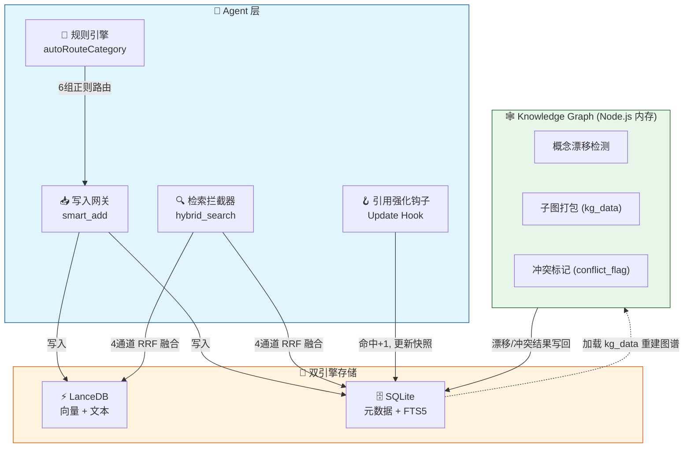

# OpenClaw Memory System v1.6

> **存算分离 · 惰性衰减 · 实证强化 · 自动召回**
> 为 AI Agent 构建的 SQLite 增强型长期记忆系统，具备置信度生命周期管理、知识图谱双轨融合与混合门控检索。

[](http://localhost:8787/)  []()

[](LICENSE)
[](https://www.python.org/)
[](https://www.sqlite.org/)

---

## 🧠 核心理念

传统 RAG 记忆系统在"查询时"被动搜索原始日志,容易陷入**语义冗余、置信度缺失、知识僵尸化**三大陷阱。

记忆引擎v1.4新增**LanceDB 双引擎存储**与**实时分类规则引擎**,将记忆系统从单一 SQLite 升级为 LanceDB + SQLite 双轨架构。同时借鉴认知科学中的**间隔重复效应**与**遗忘曲线**,将记忆管理升级为**主动生命周期治理**:

- **写入时编译**:信息入库即赋予初始置信度与半衰期,不同类别走不同遗忘曲线
- **检索时惰性衰减**:不写库、不刷表,仅在召回瞬间实时计算时间衰减
- **引用时才强化**:只有被 Agent 实际采纳的记忆才增加权重,杜绝噪音虚假繁荣
- **双轨融合**:SQLite 作为持久元数据存储,LanceDB 作为向量引擎,Node.js 知识图谱作为内存抽象引擎

---

## 🏗️ 架构概览


## 🔬 核心算法

### 动态半衰期(间隔重复)

记忆被反复引用后,遗忘速度指数级下降,但巩固有生理上限:

$$\tau(\text{hits}) = \tau_{\min} + (365 - \tau_{\min}) \cdot (1 - e^{-0.3 \cdot \text{hits}})$$

| 命中次数 (hits) | 半衰期 τ (base_tau=7) | 半衰期 τ (base_tau=30) |
|:---:|:---:|:---:|
| 0 | 7 天 | 30 天 |
| 3 | 67 天 | 145 天 |
| 5 | 121 天 | 215 天 |
| 10 | 266 天 | 318 天 |
| ∞ | 365 天 | 365 天 |

### 实时置信度衰减

$$\text{Conf}_{\text{realtime}} = \max\left(0,\ \text{Conf}_{\text{snapshot}} \cdot e^{-\frac{\Delta t}{\tau(\text{hits})}} - \text{Penalty}_{\text{conflict}}\right)$$

### 混合门控排序

抛弃暴力的向量相似度 × 置信度乘法,采用门控过滤 + 加权求和:

$$\text{Score}_{\text{final}} = 0.7 \cdot \text{Sim} + 0.3 \cdot \text{Conf}_{\text{realtime}}$$

语义相似度低于 0.55 的直接淘汰,不参与后续排序。

---

## 📊 记忆分级法则

不同来源的记忆,从出生起就走不同的遗忘曲线:

| 类别 | 初始置信度 | 基础半衰期 | 典型场景 |
|:---|:---:|:---:|:---|
| `temporary` | 0.40 | 2 天 | 临时变量、单次任务 |
| `raw_log` | 0.50 | 7 天 | 日常对话、未提炼想法 |
| `episodic` | 0.70 | 30 天 | 情节摘要、会话总结 |
| `preference` | 0.70 | 30 天(→90) | 用户习惯、**自动从raw_log升级** |
| `kg_node` | 0.85 | 90 天 | 图谱提炼的结构化结论 |
| `user_identity` | 0.95 | 365 天 | 核心身份、受保护信息 |

> **自动分类升级 v1.4**: `smart_add` 入口新增 `autoRouteCategory` 规则引擎(6 组正则),实时自动路由,无需等待夜间 cron。显式传 category 时尊重原值。

---

## ⚡ 关键设计决策

| 决策 | 说明 |
|:---|:---|
| **惰性衰减** | 时间流逝不消耗 I/O。仅在检索或归档时,基于 `last_confidence_update` 实时计算衰减 |
| **禁止心跳写回** | 指数衰减 $e^{-(t_1+t_2)} = e^{-t_1}e^{-t_2}$ 数学上连续,心跳写回不改变衰减曲线,但会污染字段语义。心跳仅标记 `is_archived` |
| **引用强化** | 检索 ≠ 记忆强化。仅 LLM 返回的 `cited_memory_ids` 触发 `hit_count+1` 和置信度 +0.1 |
| **冲突双链路** | 快速链路:图谱概念漂移 → 直接打标;慢速链路:心跳 LLM 扫描历史矛盾 |
| **子图容器** | KG 结论以 `{"core_concept","triplets":[...]}` 格式存入 `kg_data`,重启时完整重建内存图谱 |

---

## ✨ 新增特性
###  v1.2(2026-05-16)

### FTS5 并行召回
利用 OpenClaw 原生 `chunks_fts` 虚拟表,在向量搜索的同时并行执行 FTS5 BM25 全文搜索。专有名词、代码库名、API 名称等关键词精准命中,弥补纯语义搜索短板。

### RRF 三通道融合
搜索请求并行发送至 **向量语义 → FTS5 关键词 → KG 概念桥** 三个独立检索器,结果以 Reciprocal Rank Fusion (k=60) 等权融合排序。≥3 通道时 `rrf_multi`,2 通道时 `rrf_dual`。

### 情节摘要中间层 (Episodic Memory)
`summarize` 命令汇聚 raw_log 日志,通过 LLM 生成情节摘要(fallback 关键词摘要),存为 `episodic` 类别(τ=30 天)。`kg_data` 存储 `episode_of` 链接原始 chunk ID,支持 `drill <chunk_id>` 下钻查看原文。搜索含时间意向词(上次/昨天/回顾)时,episodic 结果 RRF 自动加权 +0.1。

### 检索管线演进
| 版本 | 检索方式 |
|:---|:---|
| v1.0 | 单通道:向量 + 置信度加权 |
| v1.1 | 双通道:向量 + FTS5(简单并集) |
| **v1.2** | **三通道:向量 + FTS5 + KG → RRF 融合** |

### v1.3 (2026-05-18) - 插件合约 + session 检查点

- **Plugin contracts** - 声明 `contracts: { tools: true }` 和工具名,完善 OpenClaw 插件注册
- **image_vision 工具** - 注册到 memory-engine 插件,调用 Qwen3-VL-32B-Instruct 识别图片
- **session-checkpoint.js** - 新脚本:每日 03:55 提取配置 → 写 preference → 生成 episode → 标记冲突
- **detectConfig()** - smart_add 中自动检测配置关键词,将 raw_log 升级为 preference
- **冲突自动标记** - 同 key 配置只保留最新,旧条目设 conflict_flag=1
- **Prompt Supplement** - 动态注入昨日 episode + 受保护记忆,session 启动即 warm-start

### v1.4 (2026-05-20) - 规则引擎 + LanceDB 双引擎存储

- **autoRouteCategory 规则引擎** - `smart_add` 入口 6 组正则实时分类路由,无需等待夜间 cron
- **LanceDB 双引擎** - LanceDB 存储向量+文本,与 SQLite(元数据)并行读写
- **4 通道 RRF 融合** - 检索管线新增 LanceDB 向量通道,与 Manager + FTS5 + KG 构成 4 通道
- **session-checkpoint 增强** - 3→1 次 LLM 调用,产出 6 类结构化记忆 + 摘要 + 配置 + 去重
- **迁移脚本** - `scripts/migrate-to-lancedb.js` 一次性迁移现有 chunks

### v1.5 (2026-05-24) - autoRecall 自动注入 + Memory Console

- **autoRecall 自动检索** — 注册 `before_prompt_build` hook，每轮回复前自动调混合检索注入 topK 记忆
- **Memory Console Lite** — 独立控制台 (`http://localhost:8787/`)，Dashboard / Session Trace / Memory Inspector / Telemetry / Metrics


### v1.6 (2026-05-25) - Memory Engine 架构整理

完成 FTS 查询预处理解耦：

- 新增 `query-utils.js`
- 将：
  - `sanitizeFtsQuery()`
  - `buildFtsFallbackQuery()`
  从 `auto-recall.js` 抽离
- `index.js` 与 `auto-recall.js` 统一改为依赖 `query-utils.js`

效果：

- 消除 `index -> auto-recall` 的反向耦合
- retrieval pipeline 更清晰
- 为后续 recall strategy 扩展做准备


### Memory Console 指标系统升级

新增第一代“记忆质量指标（Memory Quality Metrics）”。

#### Retrieval Diversity（检索多样性）

基于近 7 天 `memory_candidate_retrieved` 事件统计：

- `distinct_categories`
- `entropy`
- `normalized_entropy`
- `top1_share`

用于评估：

- recall 是否过度集中
- 记忆类别覆盖是否健康
- retrieval 是否发生“单一化”


#### Reinforcement Concentration（强化集中度）

基于 active memories 的 `hit_count` 分析：

- `reinforced_memories`
- `top10_share`
- `hhi`

用于评估：

- 是否出现“超级记忆”
- reinforcement 是否过度集中
- 长期记忆结构是否失衡


### Console Dashboard 改进

更新 Metrics 页面：

- 新增 Diversity Metrics 卡片
- 新增 Reinforcement Metrics 卡片
- 保持旧 telemetry API 向后兼容


### CodeGraph 集成

完成 CodeGraph + Codex CLI 工作流接入：

- 成功建立 memory-engine 局部代码图谱
- 验证 symbol / call graph / dependency tracing 工作正常
- 建立 lightweight graph indexing 工作流

新增：

- `.codegraph/` gitignore 保护
- graph scope 控制流程（避免 node_modules 污染）


### Runtime / 基础设施改进

更新 `session-checkpoint.js`：

- LLM timeout：
  - `45s → 120s`
- Cron timeout：
  - `120s → 300s`
- Cron 时间：
  - `03:55 → 03:30`

新增：

- `getDSKey()`
- `getDSBaseUrl()`
- DeepSeek fallback 支持
- provider 抽象能力
- `quickHealthCheck()`
- `writeLLMTimeoutEpisode()`

并将密钥独立迁移至：

```txt
credentials/deepseek-api-key

### v1.7 (2026-05-26) Retrieval 稳定化修复

#### 已修复

- 修复 fallback rerank 会将零 grounding 候选提升进入 `post_rerank_topK` 的问题
- 新增 fallback lexical grounding 过滤：
  - 当：
    - `token_coverage <= 0`
    - `exact_bonus <= 0`
  - 时直接丢弃候选
- 阻止仅依赖 `category_boost` / `recency_boost` 的噪音记忆进入 recall

#### 已改进

- query normalization 现已正确剥离 OpenClaw 时间戳污染
- `version_5_20` token normalization 生效
- autoRecall injection gate 已接入运行时
- smart-add ingestion / indexing 已恢复正常
- session-checkpoint dedup 已修复
- FTS fallback 已恢复工作

#### 效果

- `5.20+ compatibility` episodic recall 已可稳定命中
- 旧 raw_log / 模型价格类噪音明显下降
- fallback rerank 不再提升弱相关 recent memory
- retrieval precision 明显提高

#### 设计变化

本次修改为 fallback semantic retrieval 建立了 lexical grounding floor：

semantic recall 不再允许完全脱离 token overlap / exact anchor。
- **Task classifier** — `scripts/task-classifier.js` 按输入关键词路由 coding / default 任务


