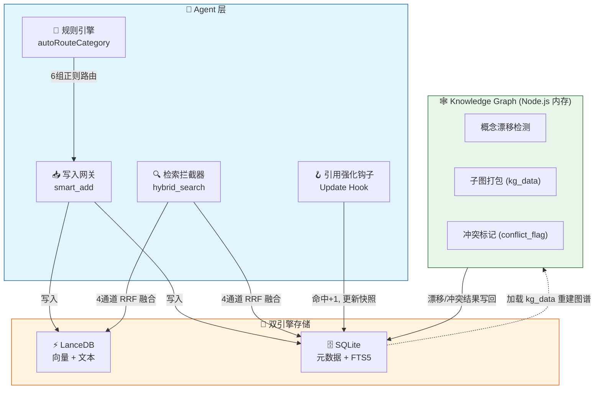

# OpenClaw Memory System v0.8.4

> **存算分离 · 惰性衰减 · 实证强化 · 自动召回**
> 为 AI Agent 构建的 SQLite 增强型长期记忆系统，具备置信度生命周期管理、知识图谱双轨融合与混合门控检索。

  

---

## 🧠 核心理念

传统 RAG 记忆系统在"查询时"被动搜索原始日志,容易陷入**语义冗余、置信度缺失、知识僵尸化**三大陷阱。

记忆引擎v1.4新增**LanceDB 双引擎存储**与**实时分类规则引擎**,将记忆系统从单一 SQLite 升级为 LanceDB + SQLite 双轨架构。同时借鉴认知科学中的**间隔重复效应**与**遗忘曲线**,将记忆管理升级为**主动生命周期治理**:

- **写入时编译**:信息入库即赋予初始置信度与半衰期,不同类别走不同遗忘曲线
- **检索时惰性衰减**:不写库、不刷表,仅在召回瞬间实时计算时间衰减
- **引用时才强化**:只有被 Agent 实际采纳的记忆才增加权重,杜绝噪音虚假繁荣
- **双轨融合**:SQLite 作为持久元数据存储,LanceDB 作为向量引擎,Node.js 知识图谱作为内存抽象引擎

---

## 🏗️ 架构概览

## 🔬 核心算法

### 动态半衰期(间隔重复)

记忆被反复引用后,遗忘速度指数级下降,但巩固有生理上限:

$$\tau(\text{hits}) = \tau_{\min} + (365 - \tau_{\min}) \cdot (1 - e^{-0.3 \cdot \text{hits}})$$

| 命中次数 (hits) | 半衰期 τ (base_tau=7) | 半衰期 τ (base_tau=30) |
|:---:|:---:|:---:|
| 0 | 7 天 | 30 天 |
| 3 | 67 天 | 145 天 |
| 5 | 121 天 | 215 天 |
| 10 | 266 天 | 318 天 |
| ∞ | 365 天 | 365 天 |

### 实时置信度衰减

$$\text{Conf}_{\text{realtime}} = \max\left(0,\ \text{Conf}_{\text{snapshot}} \cdot e^{-\frac{\Delta t}{\tau(\text{hits})}} - \text{Penalty}_{\text{conflict}}\right)$$

### 混合门控排序

抛弃暴力的向量相似度 × 置信度乘法,采用门控过滤 + 加权求和:

$$\text{Score}_{\text{final}} = 0.7 \cdot \text{Sim} + 0.3 \cdot \text{Conf}_{\text{realtime}}$$

语义相似度低于 0.55 的直接淘汰,不参与后续排序。

---

## 📊 记忆分级法则

不同来源的记忆,从出生起就走不同的遗忘曲线:

| 类别 | 初始置信度 | 基础半衰期 | 典型场景 |
|:---|:---:|:---:|:---|
| `temporary` | 0.40 | 2 天 | 临时变量、单次任务 |
| `raw_log` | 0.50 | 7 天 | 日常对话、未提炼想法 |
| `episodic` | 0.70 | 30 天 | 情节摘要、会话总结 |
| `preference` | 0.70 | 30 天(→90) | 用户习惯、**自动从raw_log升级** |
| `kg_node` | 0.85 | 90 天 | 图谱提炼的结构化结论 |
| `user_identity` | 0.95 | 365 天 | 核心身份、受保护信息 |

> **自动分类升级 v1.4**: `smart_add` 入口新增 `autoRouteCategory` 规则引擎(6 组正则),实时自动路由,无需等待夜间 cron。显式传 category 时尊重原值。

---

## ⚡ 关键设计决策

| 决策 | 说明 |
|:---|:---|
| **惰性衰减** | 时间流逝不消耗 I/O。仅在检索或归档时,基于 `last_confidence_update` 实时计算衰减 |
| **禁止心跳写回** | 指数衰减 $e^{-(t_1+t_2)} = e^{-t_1}e^{-t_2}$ 数学上连续,心跳写回不改变衰减曲线,但会污染字段语义。心跳仅标记 `is_archived` |
| **引用强化** | 检索 ≠ 记忆强化。仅 LLM 返回的 `cited_memory_ids` 触发 `hit_count+1` 和置信度 +0.1 |
| **冲突双链路** | 快速链路:图谱概念漂移 → 直接打标;慢速链路:心跳 LLM 扫描历史矛盾 |
| **子图容器** | KG 结论以 `{"core_concept","triplets":[...]}` 格式存入 `kg_data`,重启时完整重建内存图谱 |

---

## OpenClaw 集成说明

- `memory-core` 仍然是底层 substrate，负责 `MEMORY.md` / `memory/*.md` 索引与基础检索能力。
- `memory-engine` 是 enhancement layer，在 `memory-core` 之上增加混合搜索重排、置信度生命周期和引用强化，不接管 OpenClaw 的 memory slot。
- 面向 agent 的窄工具为 `memory_engine_search` 与 `memory_engine_get`；原有 `memory_engine` 保留以兼容既有调用。
- `active-memory` 与 `memory-engine` 的 `autoRecall` 不应同时启用，除非显式做去重，否则会产生重复注入。

---

- **Task classifier** — `bin/task-classifier.js` 按输入关键词路由 coding / default 任务

